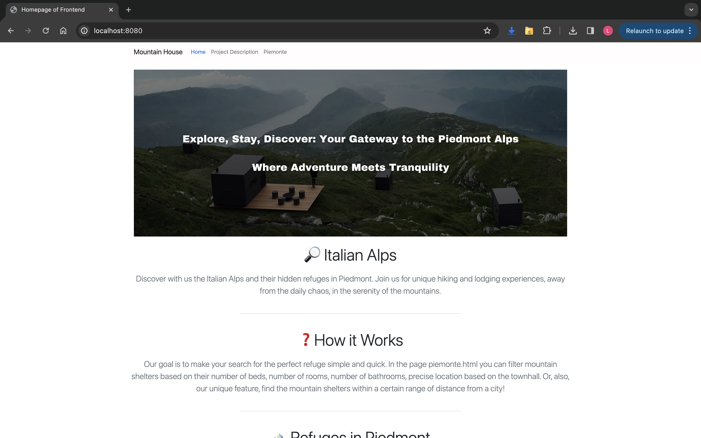
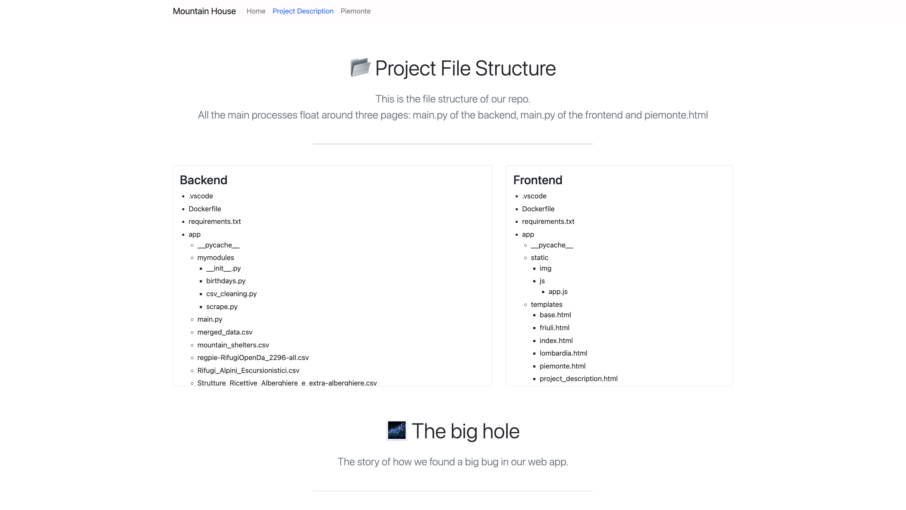
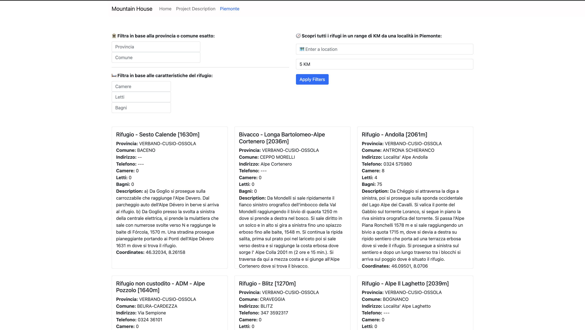

# Mountain House

## Introduction
Welcome to the "Mountain House” website, an intuitive platform designed to connect adventurers with the perfect mountain shelter. Based on comprehensive user research, this website offers a unique service to filter and find mountain shelters tailored to specific needs, such as the number of bathrooms, beds, rooms, and proximity to a certain location.

## Features
- **Shelter Listings**: Browse through an extensive list of mountain shelters with detailed information, capacity, and location.
- **Advanced Filtering**: Filter shelters based on specific requirements like the number of bathrooms, beds, and rooms to find the ideal match for your needs.
- **Distance-based Search**: Specify a range of kilometers to find shelters within close proximity to your current location or a chosen area.
- **User-friendly Interface**: Enjoy a seamless user experience with an intuitive design that makes navigation and information retrieval straightforward and efficient.

## Technologies Used
- HTML/CSS/JavaScript
- Flask (FrontEnd)
-Fast API (BackEnd)
- Bootstrap 5.0 for responsive design [here](https://getbootstrap.com/docs/5.3/getting-started/introduction/)
- Geocoding API (Google Maps)

## CSV Datasets Used in the Project
This section outlines the essential datasets to run the project, including those generated by our scraping algorithm.

We primarily use two CSV files:
1. `regpie-RifugiOpenDa_2296-all.csv` - An externally sourced dataset available [here](https://dati.gov.it/view-dataset/dataset?id=742ada85-b3cf-460b-b53b-21d0d0e5c478).
2. `mountain_shelters.csv` - That, instead, is generated by our scraping module (located in the `mymodules` folder). This module incorporates caching and saving mechanisms. The CSV is created automatically if not present; otherwise, the existing file is used.

## VS Code Extensions for Optimal Functionality
- Remote Development
- Optional: Rainbow CSV (to preview CSVs)

## How to Run the Project
1. Clone the repository via command line: 
```
git clone https://github.com/lucabarattini/NEW_REPO_LSPD_BCG.git
```
Or, otherwise, you can also use the GitHub extension in VS Code.

2. Navigate to the project folder:
```
cd NEW_REPO_LSPD_BCG
```

### Setting Up Your Google Geocoding API Key (IMPORTANT)
3. Obtain your API Key following the instructions [here](https://developers.google.com/maps/documentation/geocoding/get-api-key).
4. Replace the placeholder API key in `backend/app/main.py` with your actual key.

### Running the Project with Docker
5. Build and run the Docker image with the following commands:
```
docker compose build #this will build the docker image
```
```
docker compose up #this will run the docker image
```
6. Now, move onto the sidebar of VS and click on the docker icon. Here, by right clicking on the docker image you will be able to attach in a separate window both the backend and the frontend.
7. It's finally time for running! You can just click on the run and debug button inside the VS Code sidebar and then click on the green button that will appear on the top left corner of the screen. **You need to run both the backend and the frontend in order to see the website fully working.**

## Contributing
We welcome contributions to the "Mountain House” project. 
At the moment we worked only on the Piemonte region, to optimize the functions and algorithm at its highest. Our aim for the future is to include all the regions of Italy, and perhaps be able to deal even with another country. 
As University students, this journey started as a College Project with academic objectives, as though it is protected by MIT License.
If you have suggestions or improvements, please feel free to fork the repository and submit a pull request.

## Screenshots





## Contact
For any inquiries or further assistance, Project Lead luca.barattini@student.h-farm.com
